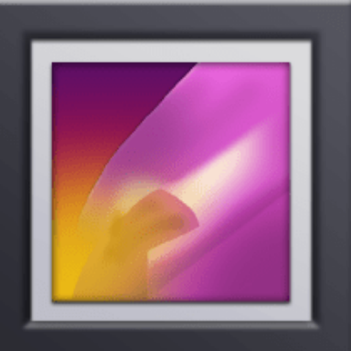

# ⚡🖼️ FastGallery

A fork of [Fossify Gallery](https://github.com/FossifyOrg/Gallery) tuned for very large libraries (built on a Pixel 8 Pro with ~68,000 photos and videos across ~250 folders).



## What is different

| Problem in stock Fossify Gallery | FastGallery |
|---|---|
| Every launch and every folder open re-walked the folder on disk (17k files in Camera, 20k in Screenshots) before showing anything current | A per-folder signature (directory mtime + cached row count + scan options) lets unchanged folders load straight from the app's own database. Pull-to-refresh still forces a full rescan. |
| Thumbnail disk cache capped at 250 MB, so a big library re-decoded full photos on every scroll | Thumbnail cache raised to 3 GB |
| Rows for unchanged folders were rewritten to the database on every launch | Skipped when a folder was served from the cache |

Everything else (features, settings, package name `org.fossify.gallery`) is stock, so it drops in over the original with your settings, pinned folders and favorites intact. Because it is signed with its own key you must uninstall the F-Droid/Obtainium build first (back up its data if you want to keep it, see below), and updates then come from this repo's Releases (Obtainium: add `https://github.com/heyitsj0n/FastGallery`).

## Install keeping your data (root)

```
am force-stop org.fossify.gallery
tar -C /data/data -cf /data/local/tmp/gallery-data.tar --exclude=org.fossify.gallery/cache org.fossify.gallery
pm uninstall org.fossify.gallery
pm install -g -r FastGallery-*.apk
appops set org.fossify.gallery MANAGE_EXTERNAL_STORAGE allow
am force-stop org.fossify.gallery
rm -rf /data/data/org.fossify.gallery/{shared_prefs,databases,files,no_backup}
tar -C /data/data -xf /data/local/tmp/gallery-data.tar
chown -R $(stat -c %U /data/data/org.fossify.gallery) /data/data/org.fossify.gallery
restorecon -R /data/data/org.fossify.gallery
```

## Building

Standard Fossify Gradle project (`./gradlew assembleFossRelease`). Signing reads `keystore.properties` or the `SIGNING_*` environment variables; the release workflow signs with the FastGallery key from repository secrets and publishes each build as a GitHub Release.

## License

GPL-3.0, same as upstream. Not affiliated with Fossify.

## Star History

[](https://star-history.com/#heyitsj0n/FastGallery&Date)
